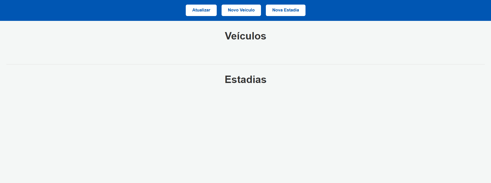
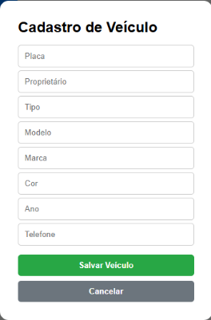
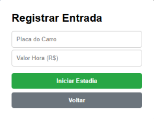
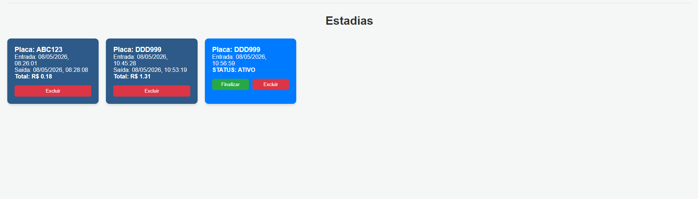
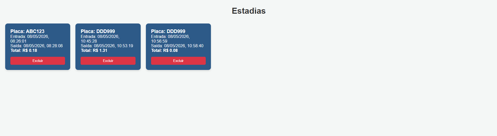
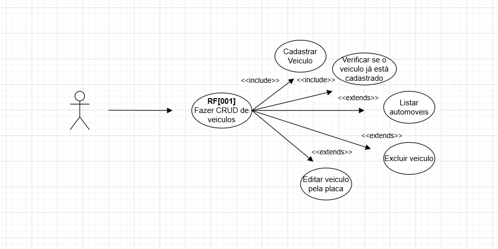
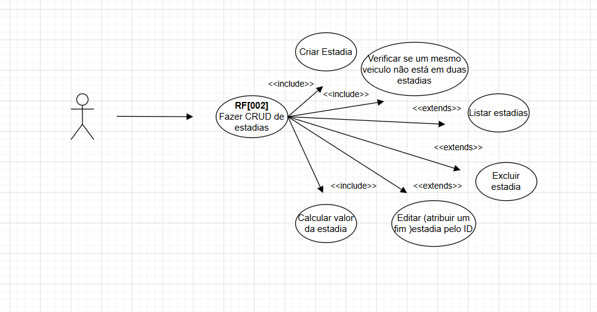
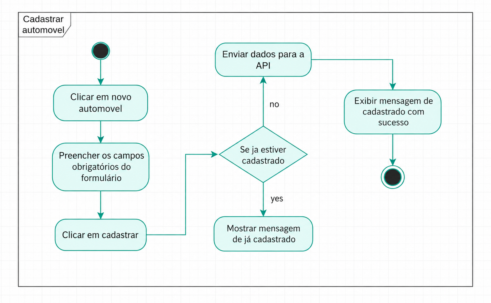
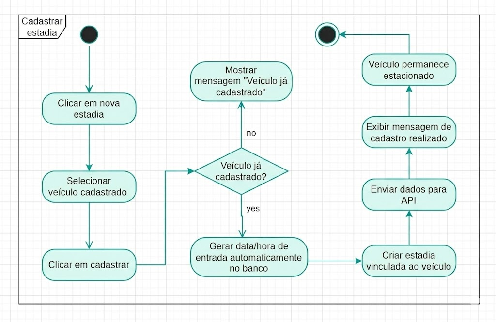
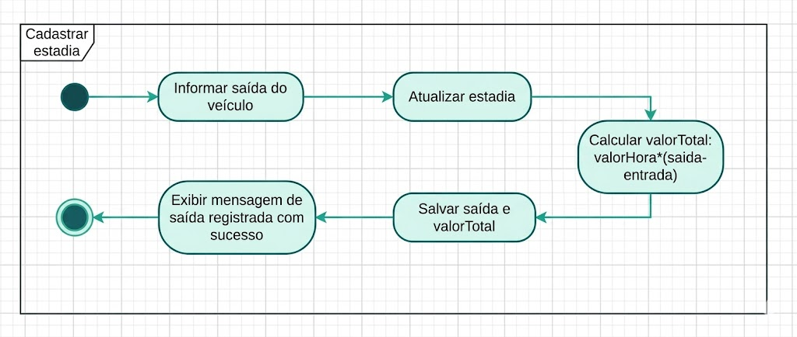

# Estacionamento Pro - Sistema de Gestão

Sistema web para controle de fluxo de veículos em estacionamentos, permitindo o cadastro detalhado de frotas e o monitoramento de tempo de permanência com cálculo automático de valores.

# Objetivo

O sistema permite:

- Cadastro de veículos
- Controle de estadias
- Entrada e saída de veículos
- Cálculo automático do valor da estadia
- Interface Web para utilização pelo atendente

# Tecnologias Utilizadas

## Back-end
- Node.js
- Express
- Prisma ORM
- MySQL
- Cors
- Dotenv

## Front-end
- HTML5
- CSS3
- JavaScript

---

## Demonstração (Screenshots)

| Tela Inicial | Cadastro de Veículos |
|---|---|
|  |  |

| Cadastro de Estadias | Estadia em Andamento |
|---|---|
|  |  | 

| Estadia Finalizada |
|---|
| |

---

## Funcionalidades

- **Módulo de Veículos**:
  - Cadastro completo seguindo rigorosamente os requisitos da API.
  - Listagem de veículos com visualização de proprietário e marca.
  - Exclusão de veículos cadastrados.
- **Módulo de Estadias**:
  - Registro de entrada vinculada à placa.
  - Botão de **Finalizar** direto no card (registra saída e calcula valor).
  - Diferenciação visual: Estadias finalizadas ficam em **azul**.
  - Exclusão de registros de histórico.

### Estrutura do Objeto (Veículo)
O sistema envia os dados para o Back-end exatamente neste formato:
```json
{
  "placa": "ABC1234",
  "proprietario": "Murilo Chiarello",
  "tipo": "Carro",
  "modelo": "Pulse",
  "marca": "Fiat",
  "cor": "Cinza Escuro",
  "ano": 2022,
  "telefone": "11 89563201"
}
```

# Como Rodar o Projeto

## BACK-END

#### Abrir o terminal na pasta do projeto

```bash
cd estacionamento
````

---

### Instalar as dependências

```bash
npm install
```

---

### Configurar o arquivo .env

Criar um arquivo chamado `.env` na raiz do projeto:

```env
PORT=3000

DATABASE_URL="mysql://root@localhost:3306/estacionamento"
```

---

### Verificar se o MySQL está ligado

Abrir:

* XAMPP
  ou
* MySQL Workbench

E iniciar o MySQL.

---

### Criar o banco de dados

No MySQL executar:

```sql
CREATE DATABASE estacionamento;
```

---

### Gerar o Prisma Client

```bash
npx prisma generate
```

---

### Continuar

```bash
npx prisma migrate dev
```

---

### Rodar o servidor

```bash
node server.js
```

---

### Resultado esperado

```bash
Servidor rodando na porta 3000
```

---

# FRONT-END

## Abrir a pasta front

Entrar na pasta onde está:

* index.html
* style.css
* script.js

---

## Abrir o index.html

Pode:

* clicar duas vezes no arquivo
  ou
* abrir com Live Server no VSCode

---

## Resultado esperado

O sistema abrirá no navegador mostrando:

* Cadastro de veículos
* Cadastro de estadias
* Listagem dos veículos
* Listagem das estadias

Consumindo a API:

```bash
http://localhost:3000
```

---

# Testando a Aplicação

## Cadastrar veículo

1. Clique em:

```txt
Novo Automóvel
```

2. Preencha os campos

3. Clique em:

```txt
Salvar
```

---

## Cadastrar estadia

1. Clique em:

```txt
Nova Estadia
```

2. Informe:

* placa
* valorHora

3. Clique em:

```txt
Salvar
```

---

## Finalizar estadia

1. Clique em:

```txt
Finalizar
```

2. O sistema irá:

* preencher saída
* calcular valorTotal

---

## Excluir

Clique no botão:

```txt
Excluir
```

do card desejado.

## Documentação 

| Diagrama de Requisitos | Diagrama de Casos de Uso - Veículos |
|---|---|
|  |  |

| Diagrama de Casos de Uso - Estadias | Diagrama de Atividades - Automovel |
|---|---|
|  |  | 

| Diagrama de Atividades - Estadia | Diagrama de Atividades - Saída |
|---|---|
| |  |


README.md Feito Por Murilo Chiarello.
